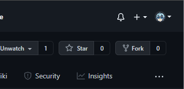

# Projet Prog Web

## Comment contribuer au projet ?

### Cloner le projet
Crée un fork du projet en appuyant ici

<p align="center">
    
</p>


- Cloner votre repo
```terminal
git clone https://github.com/<username>/ProjetProgWeb
```
- Ouvrez le projet dans votre éditeur favori et commencer à travailler.

### ⚠️ Guidelines ⚠️
**Créer un dossier avec votre partie où vous mettrez tous vos fichier HTML, CSS, JS et image.**

Votre pull request ne sera pas accepter si cette guideline n'est pas respecté.

### Enregistrer les modifications sur votre Github

- Ajouter vos fichiers
```terminal
git add fichier1 fichier2
```

- Commiter vos fichier
```terminal
git commit -m "Mon message EXPLICITE"
```

- Envoyer vos modifications sur Github
```terminal
git push
```

### Contribuer sur le projet principale
Ouvrez une pull request en clicant sur `contribute` et crée un pull request
